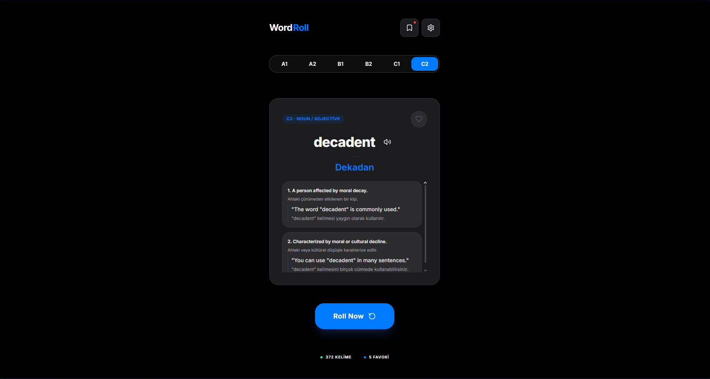
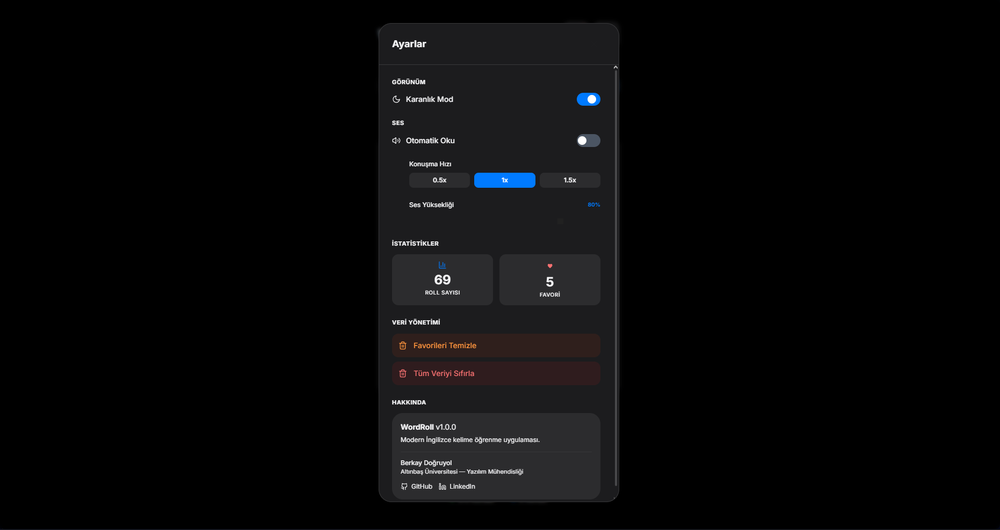
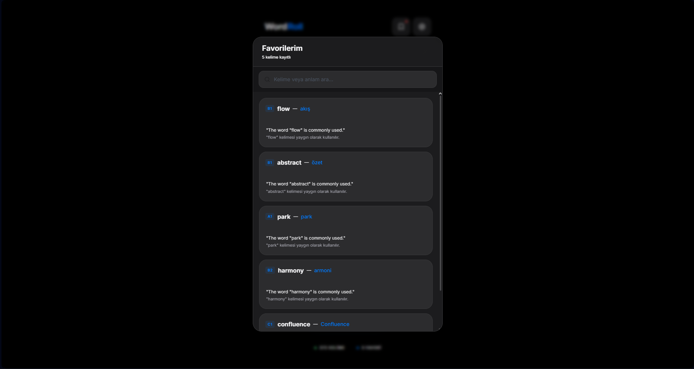

# WordRoll 🎙️🌀

**WordRoll**, İngilizce kelime dağarcığını geliştirmek isteyenler için tasarlanmış, Apple tasarım dilini (Apple Design Language) temel alan, minimalist ve yüksek performanslı bir kelime keşif uygulamasıdır. 

Uygulama, modern web teknolojilerini kullanarak kullanıcıya hem estetik hem de işlevsel bir öğrenme deneyimi sunar.

## 📱 Uygulama Görünümü

<table width="100%">
  <tr>
    <td width="33%" align="center">
      <br />
      <b>Ana Ekran</b>
    </td>
    <td width="33%" align="center">
      <br />
      <b>Kişiselleştirme</b>
    </td>
    <td width="33%" align="center">
      <br />
      <b>Kelime Kütüphanesi</b>
    </td>
  </tr>
</table>

## 🚀 Öne Çıkan Özellikler

### 🎯 Akıllı Seviye Sistemi
A1'den C2'ye kadar 6 farklı Avrupa Ortak Dil Referans Çerçevesi (CEFR) seviyesinde özelleştirilmiş kelime havuzları. Her seviye, o dil yeterliliğine sahip kullanıcılar için en uygun kelimeleri sunacak şekilde kürate edilmiştir.

### 🎙️ Singleton Vocal Mimarisi
Uygulama, "Google US English Male" öncelikli olmak üzere, sınıfının en iyisi metinden sese (TTS) motorlarını kullanır.
- **Kesintisiz Deneyim**: Kelime değişimlerinde ses tonu ve karakteri asla değişmez.
- **Özelleştirilebilir Ses**: Ayarlar menüsünden ses yüksekliği (Volume) ve konuşma hızını kendinize göre ayarlayabilirsiniz.
- **Otomatik Okuma**: İsterseniz 'Roll' sonrası kelimenin anında okunmasını etkinleştirebilirsiniz.

### 🌓 Premium Apple Estetiği
- **Dark Mode**: Sistem tercihlerinize göre otomatik geçiş veya manuel kontrol.
- **Haptic Duygu**: Mikro-interaksiyonlar ve Framer Motion animasyonları ile fiziksel bir kart çevirme hissi.
- **Akışkan Tipografi**: Her ekran boyutunda mükemmel görünen `clamp()` bazlı yazı tipi ölçeklendirmesi.

### ❤️ Favoriler ve Veri Yönetimi
- **Kalıcı Depolama**: Beğendiğiniz kelimeler tarayıcınızda güvenle saklanır.
- **Hızlı Arama**: Favorileriniz arasında kelime veya anlam bazlı anlık filtreleme yapabilirsiniz.
- **Veri Güvenliği**: Tek tıkla favorilerinizi veya tüm uygulama verilerinizi sıfırlama imkanı.

## ⚙️ Ayarlar ve Kişiselleştirme

Ayarlar paneli, WordRoll deneyiminizi tamamen size özel hale getirmenizi sağlar:

- **Volume Control**: 0-100% arası hassas ses ayarı.
- **Auto-Speak**: Kelime gelir gelmez otomatik seslendirme seçeneği.
- **Hız Ayarı**: Konuşma hızını yavaşlatarak telaffuzu daha detaylı inceleyebilirsiniz.


## 🛠️ Teknik Mimari

- **Frontend**: React 18, Vite, Tailwind CSS v4
- **Animasyon**: Framer Motion
- **İkonografi**: Lucide React
- **Veri Kaynakları**: 
  - [Dictionary API](https://dictionaryapi.dev/) (Dinamik tanımlar)
  - [MyMemory API](https://mymemory.translated.net/) (Anlık çeviri)
  - GitHub tabanlı yedek veri havuzu
- **Güvenlik**: Güçlü Content Security Policy (CSP) mühürlemesi.

## � Kurulum

1. Depoyu klonlayın:
   ```bash
   git clone https://github.com/berkaydgryl/wordroll.git
   ```
2. Bağımlılıkları yükleyin:
   ```bash
   npm install
   ```
3. Geliştirme sunucusunu başlatın:
   ```bash
   npm run dev
   ```
